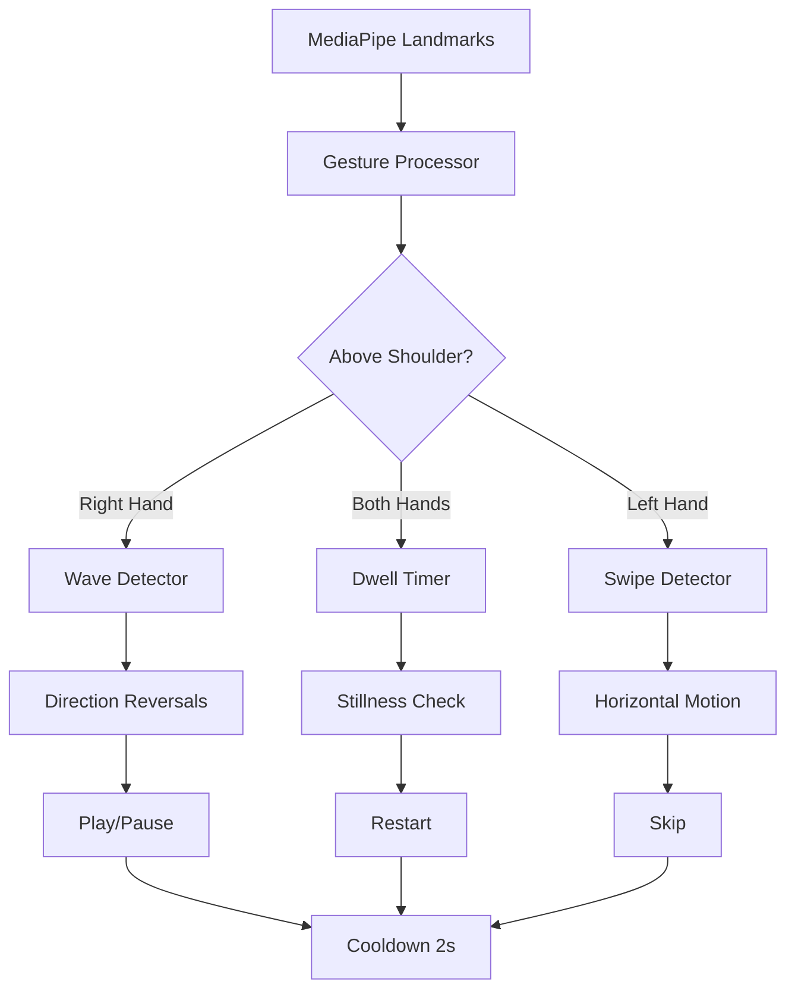

## Overview

Jiggle Wiggle includes a sophisticated gesture control system that allows you to control video playback without touching your keyboard. The system detects specific hand movements and poses using MediaPipe landmarks.

<Info>
  All gesture detection runs **client-side** using the same MediaPipe pose landmarks used for scoring, with zero performance overhead.
</Info>

## Available Gestures

<CardGroup cols={2}>
  <Card title="Wrist Wave" icon="hand-wave" color="#39ff14">
    **Action:** Play/Pause
    
    Raise right hand above shoulder and flick wrist left-right 3+ times
  </Card>
  
  <Card title="Both Hands Up" icon="hands" color="#ff6400">
    **Action:** Restart
    
    Raise both hands above head and hold still for 2 seconds
  </Card>
  
  <Card title="Left Hand Swipe" icon="hand-point-right" color="#00b4ff">
    **Action:** Skip Forward/Backward
    
    Raise left hand above shoulder and swipe horizontally
  </Card>
</CardGroup>

## Gesture Detection Architecture



## Implementation

All gesture logic is in a single module with no React state (avoids re-renders):

```typescript Module State (gestureControl.ts:33)
// MediaPipe landmark indices
const LEFT_SHOULDER = 11;
const RIGHT_SHOULDER = 12;
const LEFT_WRIST = 15;
const RIGHT_WRIST = 16;
const RIGHT_INDEX = 20;

// Module-level state (not React state — avoids re-renders)
let prevRightWrist: { x: number; y: number } | null = null;
let prevLeftWrist: { x: number; y: number } | null = null;
let bothHandsDwellStart: number | null = null;
let waveReversals: number[] = []; // timestamps
let swipeStartX: number | null = null;
let lastTriggerTime = 0;
```

## 1. Wrist Wave (Play/Pause)

Detects wrist flick by tracking fingertip-to-wrist relative offset:

<Steps>
  <Step title="Hand Position Check">
    Right hand must be above shoulder
  </Step>
  
  <Step title="Track Finger-Wrist Offset">
    Monitor horizontal distance between index finger and wrist
  </Step>
  
  <Step title="Count Direction Reversals">
    When offset changes direction (left→right or right→left), count it
  </Step>
  
  <Step title="Trigger on 3+ Reversals">
    3 direction changes within 1.2 seconds = wrist wave detected
  </Step>
</Steps>

<CodeGroup>
```typescript Wave Detection Thresholds (gestureControl.ts:28)
const WAVE_MIN_CHANGES = 3;        // Reversals needed to trigger
const WAVE_TIME_WINDOW_MS = 1200;  // Time window for counting
const WAVE_MIN_DELTA_X = 0.015;    // Min change in offset to count
```

```typescript Wave Tracker (gestureControl.ts:113)
const rightAboveShoulder = rWrist.y < rShoulder.y;
const rIndex = landmarks[RIGHT_INDEX];

if (rightAboveShoulder) {
  // Relative horizontal offset: how far fingertip is from wrist
  const offset = rIndex.x - rWrist.x;
  
  if (waveAnchorOffset === null) {
    waveAnchorOffset = offset;
    waveLastDir = 0;
  } else {
    const delta = offset - waveAnchorOffset;
    
    if (Math.abs(delta) >= WAVE_MIN_DELTA_X) {
      const dir = delta > 0 ? 1 : -1;
      
      if (waveLastDir !== 0 && dir !== waveLastDir) {
        // Direction reversed — count it
        waveReversals.push(now);
        waveAnchorOffset = offset;
      }
      waveLastDir = dir;
    }
  }

  // Prune old reversals outside time window
  waveReversals = waveReversals.filter((t) => now - t < WAVE_TIME_WINDOW_MS);

  if (waveReversals.length >= WAVE_MIN_CHANGES) {
    // Wrist wave detected!
    waveReversals = [];
    waveAnchorOffset = null;
    lastTriggerTime = now;
    return { lastAction: "play_pause", pending: null, progress: 1 };
  }

  // Show progress toward triggering
  const progress = waveReversals.length / WAVE_MIN_CHANGES;
  if (progress > 0) {
    return { lastAction: null, pending: "play_pause", progress };
  }
}
```
</CodeGroup>

<Tip>
  **Why track reversals instead of raw position?**
  
  Tracking direction changes makes the gesture robust to different camera angles and wrist flexibility. You don't need to wave a specific distance — just change direction quickly.
</Tip>

## 2. Both Hands Up (Restart)

Dwell gesture requiring stillness:

<Steps>
  <Step title="Position Check">
    Both wrists must be above shoulder level + 0.1 (normalized coords)
  </Step>
  
  <Step title="Stillness Check">
    Both hands must move less than 0.03 per frame
  </Step>
  
  <Step title="Dwell Timer">
    Hold position for 2000ms (2 seconds)
  </Step>
  
  <Step title="Trigger Restart">
    After 2s, restart action fires
  </Step>
</Steps>

<CodeGroup>
```typescript Restart Thresholds (gestureControl.ts:22)
const STILLNESS_THRESHOLD = 0.03;  // Max movement per frame
const RESTART_DWELL_MS = 2000;     // Hold duration
```

```typescript Restart Detection (gestureControl.ts:94)
const rightAboveHead = rWrist.y < Math.min(lShoulder.y, rShoulder.y) - 0.1;
const leftAboveHead = lWrist.y < Math.min(lShoulder.y, rShoulder.y) - 0.1;

// Check stillness (compare to previous frame)
const rightStill = prevRightWrist ? dist(rWrist, prevRightWrist) < STILLNESS_THRESHOLD : false;
const leftStill = prevLeftWrist ? dist(lWrist, prevLeftWrist) < STILLNESS_THRESHOLD : false;

if (rightAboveHead && leftAboveHead && rightStill && leftStill) {
  if (!bothHandsDwellStart) {
    bothHandsDwellStart = now;
  }
  
  const elapsed = now - bothHandsDwellStart;
  
  if (elapsed >= RESTART_DWELL_MS) {
    // Trigger restart
    bothHandsDwellStart = null;
    lastTriggerTime = now;
    return { lastAction: "restart", pending: null, progress: 1 };
  }
  
  // Show progress bar (0-1)
  return { lastAction: null, pending: "restart", progress: elapsed / RESTART_DWELL_MS };
} else {
  bothHandsDwellStart = null; // Reset if position not held
}
```
</CodeGroup>

<Note>
  A **progress indicator** is shown while you hold the pose, providing visual feedback that the gesture is being recognized.
</Note>

## 3. Left Hand Swipe (Skip)

Fast horizontal motion detection:

<Steps>
  <Step title="Position Check">
    Left wrist must be above shoulder
  </Step>
  
  <Step title="Track Start Position">
    Record wrist x-coordinate when hand is first raised
  </Step>
  
  <Step title="Monitor Horizontal Motion">
    Track horizontal displacement over time
  </Step>
  
  <Step title="Trigger on Fast Swipe">
    Motion ≥0.15 (normalized) within 400ms = swipe detected
  </Step>
</Steps>

<CodeGroup>
```typescript Swipe Thresholds (gestureControl.ts:25)
const SWIPE_MIN_DELTA = 0.15; // Normalized horizontal distance
const SWIPE_MAX_MS = 400;     // Max time for swipe motion
```

```typescript Swipe Detection (gestureControl.ts:160)
const leftAboveShoulder = lWrist.y < lShoulder.y;

if (leftAboveShoulder) {
  if (swipeStartX === null) {
    // Start tracking swipe
    swipeStartX = lWrist.x;
    swipeStartTime = now;
  } else if (swipeStartTime !== null) {
    const dx = lWrist.x - swipeStartX;
    const dt = now - swipeStartTime;

    if (dt <= SWIPE_MAX_MS && Math.abs(dx) >= SWIPE_MIN_DELTA) {
      // Swipe detected — direction: dx > 0 means wrist moved right in frame
      // (Webcam is mirrored, but we use raw normalized coords)
      const action: GestureAction = dx > 0 ? "skip_backward" : "skip_forward";
      
      swipeStartX = null;
      swipeStartTime = null;
      lastTriggerTime = now;
      return { lastAction: action, pending: null, progress: 0 };
    } else if (dt > SWIPE_MAX_MS) {
      // Timed out — reset swipe tracking
      swipeStartX = lWrist.x;
      swipeStartTime = now;
    }
  }
} else {
  swipeStartX = null;
  swipeStartTime = null;
}
```
</CodeGroup>

<Warning>
  **Camera Mirroring**
  
  Webcam feeds are typically mirrored. Swiping right visually corresponds to **negative** dx in normalized coordinates. The code uses raw coords, so:
  - `dx > 0` = skip backward (rewind)
  - `dx < 0` = skip forward
</Warning>

## Gesture Priority

Gestures are evaluated in priority order to avoid conflicts:

```typescript Priority Order (gestureControl.ts:94)
// Priority 1: Both hands above head (restart)
if (rightAboveHead && leftAboveHead && rightStill && leftStill) {
  // ... restart logic
}

// Priority 2: Wrist wave (play/pause)
const rightAboveShoulder = rWrist.y < rShoulder.y;
if (rightAboveShoulder) {
  // ... wave logic
}

// Priority 3: Left hand swipe (skip)
const leftAboveShoulder = lWrist.y < lShoulder.y;
if (leftAboveShoulder) {
  // ... swipe logic
}
```

<Tip>
  **Why this order?**
  - Restart requires both hands, so it must be checked first
  - Play/pause (right hand) is checked before skip (left hand)
  - Each lower-priority gesture is only checked if higher-priority conditions aren't met
</Tip>

## Cooldown System

After any gesture triggers, a 2-second cooldown prevents accidental re-triggering:

```typescript Cooldown (gestureControl.ts:62)
const COOLDOWN_MS = 2000;
let lastTriggerTime = 0;

if (now - lastTriggerTime < COOLDOWN_MS) {
  // Reset all state during cooldown
  bothHandsDwellStart = null;
  waveReversals = [];
  waveLastDir = 0;
  waveAnchorOffset = null;
  swipeStartX = null;
  swipeStartTime = null;
  prevRightWrist = { x: landmarks[RIGHT_WRIST].x, y: landmarks[RIGHT_WRIST].y };
  prevLeftWrist = { x: landmarks[LEFT_WRIST].x, y: landmarks[LEFT_WRIST].y };
  return { lastAction: null, pending: null, progress: 0 };
}
```

## Result Interface

```typescript GestureResult Type (gestureControl.ts:5)
export type GestureAction = "play_pause" | "skip_forward" | "skip_backward" | "restart";

export type GestureResult = {
  /** Action that just fired, or null if nothing triggered this frame */
  lastAction: GestureAction | null;
  
  /** Current dwell gesture being held (for progress bar), or null */
  pending: GestureAction | null;
  
  /** 0-1 progress toward dwell threshold */
  progress: number;
};
```

## Usage in Application

```typescript Integration Example (page.tsx)
import { processGestureLandmarks, resetGestureState } from "./lib/gestureControl";

function handlePose(results: PoseResults) {
  const landmarks = results.poseLandmarks;
  
  // Process gestures
  const gestureResult = processGestureLandmarks(landmarks);
  
  if (gestureResult.lastAction === "play_pause") {
    videoRef.current?.paused ? videoRef.current?.play() : videoRef.current?.pause();
  } else if (gestureResult.lastAction === "restart") {
    videoRef.current.currentTime = 0;
    videoRef.current?.play();
  } else if (gestureResult.lastAction === "skip_forward") {
    videoRef.current.currentTime += 5; // Skip 5s forward
  } else if (gestureResult.lastAction === "skip_backward") {
    videoRef.current.currentTime -= 5; // Skip 5s backward
  }
  
  // Show progress indicator for pending gestures
  if (gestureResult.pending) {
    showGestureProgress(gestureResult.pending, gestureResult.progress);
  }
}

// Reset state when starting new video
resetGestureState();
```

## Visual Feedback

Progress indicators are shown for dwell gestures:

<CodeGroup>
```jsx Restart Progress Indicator
{gestureResult.pending === "restart" && (
  <div className="gesture-progress">
    <div className="gesture-icon">🙌</div>
    <div className="progress-bar">
      <div 
        className="progress-fill" 
        style={{ width: `${gestureResult.progress * 100}%` }}
      />
    </div>
    <div className="gesture-label">Hold to Restart</div>
  </div>
)}
```

```jsx Wave Progress Indicator
{gestureResult.pending === "play_pause" && (
  <div className="gesture-progress">
    <div className="gesture-icon">👋</div>
    <div className="wave-dots">
      {[0, 1, 2].map(i => (
        <div 
          key={i}
          className={i < Math.floor(gestureResult.progress * 3) ? "dot-filled" : "dot-empty"}
        />
      ))}
    </div>
    <div className="gesture-label">Wave to Play/Pause</div>
  </div>
)}
```
</CodeGroup>

## Debugging Gestures

<AccordionGroup>
  <Accordion title="Gesture Not Detected">
    1. Check landmark visibility scores (should be >0.5)
    2. Verify hand is above shoulder threshold
    3. Ensure full body is visible in frame
    4. Check if cooldown is active (2s after last gesture)
  </Accordion>
  
  <Accordion title="False Triggers">
    1. Increase `WAVE_MIN_DELTA_X` for wave sensitivity
    2. Increase `SWIPE_MIN_DELTA` for swipe sensitivity
    3. Increase `RESTART_DWELL_MS` for restart hold time
  </Accordion>
  
  <Accordion title="Progress Bar Not Showing">
    1. Check if `gestureResult.pending` is being read
    2. Verify visual feedback component is rendering
    3. Console log `gestureResult.progress` to debug values
  </Accordion>
</AccordionGroup>

## Performance Notes

<Note>
  **Zero Overhead**
  
  Gesture detection uses the same MediaPipe landmarks already computed for scoring. No additional pose inference is required.
</Note>

<Note>
  **Module-Level State**
  
  Using module variables instead of React state avoids component re-renders on every frame, keeping the app responsive at 30fps.
</Note>

## Next Steps

<CardGroup cols={2}>
  <Card title="Scoring System" icon="chart-line" href="/features/scoring-system">
    Learn about the pose detection system that powers gesture controls
  </Card>
  
  <Card title="AI Coaching" icon="robot" href="/features/ai-coaching">
    Discover how AI feedback works hands-free with gesture controls
  </Card>
</CardGroup>