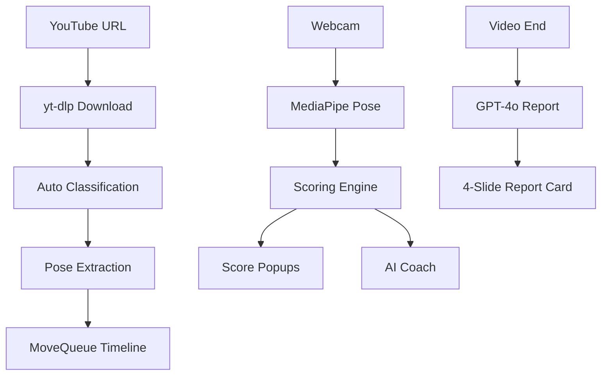

Jiggle Wiggle combines real-time pose tracking, AI-powered coaching, and advanced scoring algorithms to deliver an immersive dance and fitness experience from any YouTube video.

## Feature Highlights

<CardGroup cols={2}>
  <Card title="Pose Scoring System" icon="chart-line" href="/features/scoring-system">
    Real-time geometric pose comparison with Groq vision scoring, EMA smoothing, and hit tier classification
  </Card>
  
  <Card title="AI Coaching" icon="robot" href="/features/ai-coaching">
    OpenAI-powered LLM coach with personality-driven feedback and text-to-speech audio responses
  </Card>
  
  <Card title="Gesture Controls" icon="hand" href="/features/gesture-controls">
    Hands-free control system using wrist wave and hand raise detection for play/pause and navigation
  </Card>
  
  <Card title="AI Video Generation" icon="video" href="/features/video-generation">
    Generate custom workout and dance videos using Perplexity research, GPT-4o synthesis, and Grok video generation
  </Card>
  
  <Card title="Performance Reports" icon="trophy" href="/features/performance-reports">
    Spotify Wrapped-style report cards with letter grades, per-limb breakdowns, and AI-generated improvement tips
  </Card>
  
  <Card title="Mode Detection" icon="wand-magic-sparkles">
    Automatic classification of videos as dance or gym workouts with dynamic UI theming
  </Card>
</CardGroup>

## How It Works

<Steps>
  <Step title="Video Input">
    Paste any YouTube URL or use AI Generate to create a custom workout/dance video
  </Step>
  
  <Step title="Pose Extraction">
    MediaPipe Pose extracts key frames from the reference video at 10fps, creating a timeline of target poses
  </Step>
  
  <Step title="Real-Time Tracking">
    Your webcam feed is analyzed at 30fps using MediaPipe Pose for skeleton detection
  </Step>
  
  <Step title="Scoring & Feedback">
    Multi-signal scoring system evaluates your performance with:
    - Geometric pose comparison (50-80% weight)
    - Groq vision AI scoring (40% weight)
    - Motion heuristics (10-20% weight)
  </Step>
  
  <Step title="AI Coaching">
    OpenAI LLM monitors your pose summary every 3-5 seconds and provides live audio feedback via TTS
  </Step>
  
  <Step title="Performance Report">
    When the video ends, receive a 4-slide Spotify Wrapped-style report with grades, per-limb analysis, and tips
  </Step>
</Steps>

## Key Technologies

<AccordionGroup>
  <Accordion title="MediaPipe Pose">
    Client-side WASM-based pose detection loaded from CDN. Provides 33 3D body landmarks with visibility scores.
    
    - **Version:** 0.5.1675469404
    - **Running:** Client-side, on-device
    - **Performance:** 30fps real-time tracking
  </Accordion>
  
  <Accordion title="OpenAI GPT-4o-mini">
    Powers the AI coach with conversational feedback and the performance report card generation.
    
    - **Coach:** Real-time feedback with anti-repetition features
    - **TTS:** Audio feedback using OpenAI's text-to-speech API
    - **Reports:** Grade calculation, persona assignment, and improvement tips
  </Accordion>
  
  <Accordion title="Groq Vision">
    Periodic screenshot comparison for vision-based scoring as a complement to geometric analysis.
    
    - **Frequency:** Every 3 seconds
    - **EMA Alpha:** 0.25
    - **Weight:** 40% of final score
  </Accordion>
  
  <Accordion title="Grok (xAI)">
    AI video generation from text prompts for custom workouts and dances.
  </Accordion>
</AccordionGroup>

## Architecture Overview



## Performance Metrics

<CodeGroup>
```typescript Frame Rate
// Real-time scoring runs at 30fps
const SCORING_FPS = 30;
const FRAME_INTERVAL = 1000 / SCORING_FPS; // ~33ms
```

```typescript Pose Extraction
// Reference video processed at 10fps
const EXTRACTION_FPS = 10;
const FRAME_INTERVAL = 0.1; // seconds
```

```typescript AI Coach
// Adaptive interval based on performance
function getAdaptiveInterval() {
  if (trend === "declining" || score < 40) return 3500; // 3.5s
  if (score >= 80) return 5500; // 5.5s
  return 4500; // 4.5s default
}
```
</CodeGroup>

## What Makes It Unique

<Note>
  **Choreography-Agnostic Design**
  
  Unlike traditional dance apps that require pre-programmed choreography, Jiggle Wiggle works with ANY YouTube video. The pose extraction and comparison system adapts to whatever moves are in the video.
</Note>

<Note>
  **Multi-Signal Scoring**
  
  Combines three different scoring approaches (geometric, vision AI, and heuristics) for robust evaluation that works across different body types and camera angles.
</Note>

<Note>
  **Anti-Repetition AI Coach**
  
  The coach uses Jaccard similarity detection, style rotation, and delta tracking to ensure every piece of feedback is unique and contextual.
</Note>

## Getting Started

Ready to dive deeper? Explore each feature:

- [Scoring System](/features/scoring-system) - Understand how your moves are evaluated
- [AI Coaching](/features/ai-coaching) - Learn about the intelligent feedback system
- [Gesture Controls](/features/gesture-controls) - Control playback hands-free
- [Video Generation](/features/video-generation) - Create custom workout videos with AI
- [Performance Reports](/features/performance-reports) - Discover your stats and improvement areas