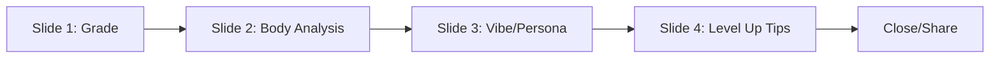

## Overview

When a video ends, Jiggle Wiggle generates a comprehensive performance report card styled like Spotify Wrapped. The report combines session statistics, per-limb analysis, and AI-generated feedback to provide an engaging summary of your performance.

<Info>
  Reports are generated using **GPT-4o-mini** with tone that adapts to your performance — S/A grades get hype, C/D grades get constructive roasts.
</Info>

## Report Structure

The report is a 4-slide interactive overlay:



<CardGroup cols={2}>
  <Card title="Slide 1: Grade" icon="trophy">
    Letter grade (S/A/B/C/D), headline, and total points
  </Card>
  
  <Card title="Slide 2: Body" icon="person">
    Per-limb scores with best/worst limb highlights
  </Card>
  
  <Card title="Slide 3: Vibe" icon="sparkles">
    AI-assigned persona and performance summary
  </Card>
  
  <Card title="Slide 4: Level Up" icon="arrow-up">
    3 personalized improvement tips
  </Card>
</CardGroup>

## Grading System

Letter grades are calculated from average score across all frames:

<CodeGroup>
```typescript Grade Thresholds
| Grade | Avg Score | Description |
|-------|-----------|-------------|
| S     | 78+       | Exceptional performance |
| A     | 62+       | Strong performance |
| B     | 45+       | Good effort |
| C     | 30+       | Needs improvement |
| D     | <30       | Keep practicing |
```

```typescript Grade Calculation
function calculateGrade(avgScore: number): "S" | "A" | "B" | "C" | "D" {
  if (avgScore >= 78) return "S";
  if (avgScore >= 62) return "A";
  if (avgScore >= 45) return "B";
  if (avgScore >= 30) return "C";
  return "D";
}
```
</CodeGroup>

<Note>
  The grade is computed from **data** (numerical thresholds). The headline, persona, roasts, and tips are **generated by GPT-4o-mini** with tone that scales to performance.
</Note>

## Session Statistics

Data collected throughout the session:

```typescript SessionStats Interface
export type SessionStats = {
  totalPoints: number;           // Sum of all hit point values
  totalHits: number;             // Number of poses hit
  perfectHits: number;           // PERFECT tier (90+ score)
  greatHits: number;             // GREAT tier (80-89)
  okHits: number;                // OK tier (60-79)
  almostHits: number;            // ALMOST tier (40-59)
  missHits: number;              // MISS tier (<40)
  maxCombo: number;              // Longest non-miss streak
  avgScore: number;              // Average score across all frames
  limbScores: Record<string, {   // Per-limb tracking
    sum: number;
    count: number;
  }>;
  duration: number;              // Session length in seconds
};
```

### Per-Limb Tracking

Each frame's geometric comparison provides per-limb scores:

```typescript Limb Score Accumulation (page.tsx)
const limbScores = geometricComparison.limbScores;
// { rightArm: 85, leftArm: 78, rightLeg: 92, leftLeg: 88, torso: 80 }

// Accumulate to session stats
for (const [limb, score] of Object.entries(limbScores)) {
  if (!sessionStats.limbScores[limb]) {
    sessionStats.limbScores[limb] = { sum: 0, count: 0 };
  }
  sessionStats.limbScores[limb].sum += score;
  sessionStats.limbScores[limb].count++;
}
```

### Limb Labels

```typescript Limb Display Names (types.ts:92)
export const LIMB_LABELS: Record<string, string> = {
  rightArm: "Right Arm",
  leftArm: "Left Arm",
  rightLeg: "Right Leg",
  leftLeg: "Left Leg",
  torso: "Torso",
};
```

## AI Report Generation

The report is generated by GPT-4o-mini with performance-adaptive tone:

<CodeGroup>
```typescript Report Generation Request (/api/report/route.ts)
export async function POST(req: Request) {
  const { stats, mode, videoTitle } = await req.json();
  
  const avgScore = stats.avgScore;
  const grade = calculateGrade(avgScore);
  
  // Calculate per-limb averages
  const limbAvgs = limbAverage(stats.limbScores);
  const bestLimb = Object.entries(limbAvgs).reduce((a, b) => b[1] > a[1] ? b : a)[0];
  const worstLimb = Object.entries(limbAvgs).reduce((a, b) => b[1] < a[1] ? b : a)[0];
  
  const prompt = `Generate a performance report for a ${mode} session.
  
  Stats:
  - Grade: ${grade}
  - Avg Score: ${avgScore}
  - Total Points: ${stats.totalPoints}
  - Perfect Hits: ${stats.perfectHits}
  - Great Hits: ${stats.greatHits}
  - OK Hits: ${stats.okHits}
  - Best Limb: ${LIMB_LABELS[bestLimb]} (${limbAvgs[bestLimb]})
  - Worst Limb: ${LIMB_LABELS[worstLimb]} (${limbAvgs[worstLimb]})
  - Duration: ${Math.floor(stats.duration / 60)}m ${stats.duration % 60}s
  
  Generate:
  1. headline (catchy, 4-8 words, tone matches grade)
  2. persona (e.g. "The Rhythm Warrior", "The Form Seeker")
  3. personaDesc (1 sentence describing the persona)
  4. summary (2-3 sentences about overall performance)
  5. tips (array of 3 specific improvement suggestions)
  
  Tone guidance:
  - S/A: Pure hype, celebration, you're a legend
  - B: Encouraging, positive reinforcement
  - C: Constructive, friendly coaching
  - D: Playful roasting but supportive, "we'll get there"
  
  Return JSON only.`;
  
  const response = await openai.chat.completions.create({
    model: "gpt-4o-mini",
    messages: [
      { role: "system", content: "You are a performance analyst for a dance/fitness app. Generate engaging, personalized report cards." },
      { role: "user", content: prompt }
    ],
    response_format: { type: "json_object" },
  });
  
  const report = JSON.parse(response.choices[0].message.content);
  return Response.json({ ...report, grade, bestLimb, worstLimb });
}
```

```typescript Report Interface (types.ts:4)
export type AIReport = {
  grade: "S" | "A" | "B" | "C" | "D";
  headline: string;          // "ABSOLUTE LEGEND STATUS"
  persona: string;           // "The Rhythm Warrior"
  personaDesc: string;       // "Moves with the precision of a pro"
  summary: string;           // "You crushed every beat..."
  tips: string[];            // ["Focus on...", "Try...", "Work on..."]
  bestLimb: string;          // "rightArm"
  worstLimb: string;         // "leftLeg"
};
```
</CodeGroup>

## Grade Colors

Each grade has a unique color scheme that changes based on mode:

<Tabs>
  <Tab title="Dance Mode">
    ```typescript Dance Grade Colors (types.ts:29)
    const DANCE_GRADE_COLORS: Record<string, GradeStyle> = {
      S: {
        color: "#00ffff",      // Cyan
        glow: "rgba(255, 0, 170, 0.6)",
        shadow: "0 0 10px rgba(0,255,255,1), 0 0 30px rgba(0,255,255,0.9), 0 0 60px rgba(255,0,170,0.6)"
      },
      A: {
        color: "#39ff14",      // Neon green
        glow: "rgba(0, 255, 255, 0.6)",
        shadow: "0 0 10px rgba(57,255,20,1), 0 0 30px rgba(57,255,20,0.9)"
      },
      B: {
        color: "#ffe100",      // Yellow
        glow: "rgba(255, 107, 43, 0.6)",
        shadow: "0 0 10px rgba(255,225,0,1)"
      },
      C: {
        color: "#ff6b2b",      // Orange
        glow: "rgba(255, 0, 60, 0.6)",
        shadow: "0 0 10px rgba(255,107,43,1)"
      },
      D: {
        color: "#ff003c",      // Red
        glow: "rgba(184, 41, 255, 0.6)",
        shadow: "0 0 10px rgba(255,0,60,1)"
      }
    };
    ```
  </Tab>
  
  <Tab title="Gym Mode">
    ```typescript Gym Grade Colors (types.ts:56)
    const GYM_GRADE_COLORS: Record<string, GradeStyle> = {
      S: {
        color: "#a0d4ff",      // Light blue
        glow: "rgba(255, 107, 43, 0.6)",
        shadow: "0 0 10px rgba(160,212,255,1)"
      },
      A: {
        color: "#4ade80",      // Green
        glow: "rgba(160, 212, 255, 0.6)",
        shadow: "0 0 10px rgba(74,222,128,1)"
      },
      B: {
        color: "#ffb347",      // Peach
        glow: "rgba(255, 140, 66, 0.6)",
        shadow: "0 0 10px rgba(255,179,71,1)"
      },
      C: {
        color: "#ff8c42",      // Orange
        glow: "rgba(255, 68, 68, 0.6)",
        shadow: "0 0 10px rgba(255,140,66,1)"
      },
      D: {
        color: "#ff4444",      // Red
        glow: "rgba(255, 107, 43, 0.6)",
        shadow: "0 0 10px rgba(255,68,68,1)"
      }
    };
    ```
  </Tab>
</Tabs>

## Slide Breakdown

### Slide 1: Grade

Displays the letter grade with explosive visual effects:

<CodeGroup>
```tsx SlideGrade Component (SlideGrade.tsx)
export default function SlideGrade({ report, videoTitle, active, mode }: Props) {
  const colors = getGradeColors(report.grade, mode);
  
  return (
    <div className={`slide ${active ? "slide-active" : ""}`}>
      {/* Giant letter grade with glow */}
      <div
        className="grade-letter"
        style={{
          fontSize: "clamp(8rem, 20vw, 16rem)",
          color: colors.color,
          textShadow: colors.shadow,
          animation: "grade-slam-in 0.8s cubic-bezier(0.34, 1.56, 0.64, 1)"
        }}
      >
        {report.grade}
      </div>
      
      {/* Headline */}
      <div className="headline">{report.headline}</div>
      
      {/* Video title */}
      <div className="video-title">{videoTitle}</div>
    </div>
  );
}
```

```css Grade Animation
@keyframes grade-slam-in {
  0% {
    transform: scale(0) rotate(-45deg);
    opacity: 0;
  }
  50% {
    transform: scale(1.3) rotate(5deg);
  }
  100% {
    transform: scale(1) rotate(0deg);
    opacity: 1;
  }
}
```
</CodeGroup>

### Slide 2: Body Analysis

Per-limb breakdown with best/worst highlights:

```tsx SlideBody Component (SlideBody.tsx)
const limbAvgs = limbAverage(stats.limbScores);
const bestScore = Math.max(...Object.values(limbAvgs));
const worstScore = Math.min(...Object.values(limbAvgs));

return (
  <div className="slide-body">
    <h2>Body Breakdown</h2>
    
    <div className="limb-grid">
      {Object.entries(limbAvgs).map(([limb, score]) => {
        const isBest = limb === report.bestLimb;
        const isWorst = limb === report.worstLimb;
        
        return (
          <div
            key={limb}
            className={`limb-card ${isBest ? "best" : ""} ${isWorst ? "worst" : ""}`}
          >
            <div className="limb-label">{LIMB_LABELS[limb]}</div>
            <div className="limb-score">{score}</div>
            
            {isBest && <div className="badge">🏆 Best</div>}
            {isWorst && <div className="badge">🎯 Focus</div>}
          </div>
        );
      })}
    </div>
    
    {/* Hit distribution chart */}
    <div className="hit-distribution">
      <div className="bar" style={{ width: `${(stats.perfectHits / stats.totalHits) * 100}%` }} />
      <div className="bar" style={{ width: `${(stats.greatHits / stats.totalHits) * 100}%` }} />
      <div className="bar" style={{ width: `${(stats.okHits / stats.totalHits) * 100}%` }} />
    </div>
  </div>
);
```

### Slide 3: Vibe/Persona

AI-generated persona with summary:

```tsx SlideVibe Component (SlideVibe.tsx)
return (
  <div className="slide-vibe">
    {/* Persona title */}
    <div className="persona-title">{report.persona}</div>
    <div className="persona-desc">{report.personaDesc}</div>
    
    {/* Key stats */}
    <div className="stat-cards">
      <div className="stat-card">
        <div className="stat-value">{stats.totalPoints}</div>
        <div className="stat-label">Total Points</div>
      </div>
      <div className="stat-card">
        <div className="stat-value">{stats.maxCombo}x</div>
        <div className="stat-label">Max Combo</div>
      </div>
      <div className="stat-card">
        <div className="stat-value">{Math.round(stats.avgScore)}</div>
        <div className="stat-label">Avg Score</div>
      </div>
    </div>
    
    {/* Summary paragraph */}
    <div className="summary">{report.summary}</div>
  </div>
);
```

### Slide 4: Level Up Tips

Personalized improvement suggestions:

```tsx SlideLevelUp Component (SlideLevelUp.tsx)
return (
  <div className="slide-levelup">
    <h2>Level Up</h2>
    
    <div className="tips-list">
      {report.tips.map((tip, i) => (
        <div key={i} className="tip-card" style={{ animationDelay: `${i * 0.1}s` }}>
          <div className="tip-number">{i + 1}</div>
          <div className="tip-text">{tip}</div>
        </div>
      ))}
    </div>
    
    {/* Action buttons */}
    <div className="actions">
      <button onClick={onClose}>Close</button>
      <button onClick={handleShare}>Share Results</button>
      <button onClick={handleTryAgain}>Try Again</button>
    </div>
  </div>
);
```

## Example Report Outputs

<AccordionGroup>
  <Accordion title="S Grade Example">
    ```json
    {
      "grade": "S",
      "headline": "ABSOLUTE LEGEND STATUS",
      "persona": "The Rhythm Warrior",
      "personaDesc": "Moves with the precision of a seasoned pro",
      "summary": "You crushed every beat like a dance god. Your form was tight, energy was high, and you didn't miss a single critical moment. This is what peak performance looks like.",
      "tips": [
        "Try a harder video to push your limits even further",
        "Record and share your session to inspire others",
        "Focus on adding more style and flair to your moves"
      ],
      "bestLimb": "rightArm",
      "worstLimb": "leftLeg"
    }
    ```
  </Accordion>
  
  <Accordion title="B Grade Example">
    ```json
    {
      "grade": "B",
      "headline": "Solid Work, Keep It Up",
      "persona": "The Steady Climber",
      "personaDesc": "Consistent effort with room to grow",
      "summary": "You showed good fundamentals and stayed engaged throughout. There were some rough spots, but overall you kept up well. With more practice, you'll nail this.",
      "tips": [
        "Focus on your left leg placement during transitions",
        "Try slowing down the video to perfect difficult sections",
        "Work on arm symmetry to balance your movements"
      ],
      "bestLimb": "torso",
      "worstLimb": "leftLeg"
    }
    ```
  </Accordion>
  
  <Accordion title="D Grade Example">
    ```json
    {
      "grade": "D",
      "headline": "Rome Wasn't Built in a Day",
      "persona": "The Brave Beginner",
      "personaDesc": "Every legend starts somewhere",
      "summary": "Look, it was rough out there, but you showed up and that's what counts. This video might be a bit too advanced right now, but don't let that stop you. Start with easier content and work your way up.",
      "tips": [
        "Try beginner-level videos to build fundamentals",
        "Focus on one body part at a time instead of full choreography",
        "Practice in front of a mirror to see your form"
      ],
      "bestLimb": "torso",
      "worstLimb": "rightArm"
    }
    ```
  </Accordion>
</AccordionGroup>

## Navigation & Interaction

The report uses intuitive navigation:

```typescript Report Navigation (ReportCard.tsx)
const [slide, setSlide] = useState(0);
const TOTAL_SLIDES = 4;

const advance = useCallback(() => {
  if (slide >= TOTAL_SLIDES - 1) {
    onClose(); // Last slide -> close
  } else {
    setSlide((s) => s + 1);
  }
}, [slide, onClose]);

// Click anywhere to advance
return (
  <div className="report-overlay" onClick={advance}>
    {/* Slides */}
    <SlideGrade active={slide === 0} />
    <SlideBody active={slide === 1} />
    <SlideVibe active={slide === 2} />
    <SlideLevelUp active={slide === 3} />
    
    {/* Dot navigation */}
    <div className="dot-nav">
      {[0, 1, 2, 3].map(i => (
        <button
          key={i}
          className={slide === i ? "dot-active" : "dot"}
          onClick={(e) => {
            e.stopPropagation();
            setSlide(i);
          }}
        />
      ))}
    </div>
    
    {/* Tap hint */}
    {slide === 0 && <div className="tap-hint">Tap to continue</div>}
  </div>
);
```

<Tip>
  **User Experience**
  
  - Click anywhere to advance to next slide
  - Click dots to jump to specific slide
  - ESC key closes the report
  - Last slide has explicit "Close" button
</Tip>

## Sharing & Recording

Users can share their results:

```typescript Share Functionality
const handleShare = async () => {
  // Generate shareable image
  const canvas = await html2canvas(reportRef.current);
  const dataUrl = canvas.toDataURL("image/png");
  
  // Share via Web Share API
  if (navigator.share) {
    const blob = await (await fetch(dataUrl)).blob();
    const file = new File([blob], "jiggle-wiggle-report.png", { type: "image/png" });
    
    await navigator.share({
      title: `I got a ${report.grade} on Jiggle Wiggle!`,
      text: report.headline,
      files: [file],
    });
  } else {
    // Fallback: download image
    const link = document.createElement("a");
    link.download = "jiggle-wiggle-report.png";
    link.href = dataUrl;
    link.click();
  }
};
```

## Next Steps

<CardGroup cols={2}>
  <Card title="Scoring System" icon="chart-line" href="/features/scoring-system">
    Learn how the scores in your report are calculated
  </Card>
  
  <Card title="AI Coaching" icon="robot" href="/features/ai-coaching">
    Understand how live coaching observations inform report generation
  </Card>
</CardGroup>