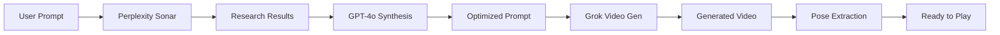

## Overview

Jiggle Wiggle includes an AI video generation feature that creates custom dance or workout videos from text prompts. The system uses a multi-stage pipeline combining research, synthesis, and video generation.

<Info>
  This feature allows you to practice **any** workout or dance routine, even if no YouTube video exists for it.
</Info>

## Architecture



## Three-Stage Pipeline

### Stage 1: Research (Perplexity Sonar)

Gathers authoritative information about the requested workout or dance:

<CodeGroup>
```typescript Perplexity API Call
const researchResponse = await fetch(
  "https://api.perplexity.ai/chat/completions",
  {
    method: "POST",
    headers: {
      "Authorization": `Bearer ${process.env.PERPLEXITY_API_KEY}`,
      "Content-Type": "application/json",
    },
    body: JSON.stringify({
      model: "sonar",
      messages: [
        {
          role: "system",
          content: "You are a fitness and dance expert. Research the requested workout or dance style and provide authoritative information about proper form, key moves, and typical structure."
        },
        {
          role: "user",
          content: userPrompt // e.g. "5 minute HIIT workout"
        }
      ],
    }),
  }
);

const researchData = await researchResponse.json();
const researchSummary = researchData.choices[0].message.content;
```

```typescript Example Research Output
// Input: "5 minute HIIT workout"
// Output:
{
  "summary": "HIIT (High-Intensity Interval Training) workouts alternate between intense bursts of activity and fixed periods of less-intense activity. A 5-minute HIIT session typically includes:
  
  1. Warm-up (30s): Light jogging in place
  2. High knees (45s): Rapid knee lifts
  3. Rest (15s)
  4. Burpees (45s): Full body explosive movement
  5. Rest (15s)
  6. Mountain climbers (45s): Plank position with alternating knee drives
  7. Rest (15s)
  8. Jump squats (45s): Explosive squat jumps
  9. Cool down (30s): Light stretching
  
  Key form cues:
  - Keep core engaged
  - Land softly on jumps
  - Maintain controlled breathing"
}
```
</CodeGroup>

<Note>
  **Why Perplexity?**
  
  Perplexity's Sonar model is optimized for factual research and cites sources, ensuring the workout structure is based on real fitness science.
</Note>

### Stage 2: Synthesis (GPT-4o)

Converts research into an optimized video generation prompt:

<CodeGroup>
```typescript GPT-4o Synthesis
const synthesisResponse = await fetch(
  "https://api.openai.com/v1/chat/completions",
  {
    method: "POST",
    headers: {
      "Authorization": `Bearer ${process.env.OPENAI_API_KEY}`,
      "Content-Type": "application/json",
    },
    body: JSON.stringify({
      model: "gpt-4o",
      messages: [
        {
          role: "system",
          content: `You are a video prompt engineer. Convert the research summary into a detailed video generation prompt that:
          
          1. Describes visual style (lighting, camera angle, setting)
          2. Specifies exact movements in sequence
          3. Includes timing and transitions
          4. Describes person's appearance and attire
          5. Specifies camera work (static, following, etc.)
          
          Keep the prompt under 500 words. Be specific and visual.`
        },
        {
          role: "user",
          content: `Research summary:\n${researchSummary}\n\nOriginal request: ${userPrompt}`
        }
      ],
    }),
  }
);

const synthesisData = await synthesisResponse.json();
const optimizedPrompt = synthesisData.choices[0].message.content;
```

```typescript Example Optimized Prompt
// Synthesized from HIIT research:
{
  "prompt": "A fit person in athletic wear (black shorts, gray tank top) demonstrates a 5-minute HIIT workout in a bright, minimalist gym with white walls and wooden floor. Camera is static, positioned at medium distance to show full body.
  
  Scene 1 (0:00-0:30): Person jogs in place with relaxed form, arms swinging naturally. Smooth breathing visible.
  
  Scene 2 (0:30-1:15): Rapid high knees - person drives knees up to hip height alternating legs at high speed, arms pumping. Energy increases.
  
  Scene 3 (1:15-1:30): Brief rest - person stands, hands on hips, catching breath.
  
  Scene 4 (1:30-2:15): Burpees - person squats, places hands on ground, jumps feet back to plank, does push-up, jumps feet forward, explosive jump up with arms overhead. Repeat 8 times.
  
  [continues for all movements...]
  
  Lighting: Bright natural light from left. Person is centered in frame throughout. Focus on clear visibility of all movements for form demonstration."
}
```
</CodeGroup>

<Tip>
  **GPT-4o's Role**
  
  GPT-4o is used (not GPT-4o-mini) because it excels at creative synthesis and understanding visual concepts. The optimized prompt is much more detailed and video-generation-friendly than the raw research.
</Tip>

### Stage 3: Video Generation (Grok)

Generates the actual video using xAI's Grok model:

<CodeGroup>
```typescript Grok Video API
const videoResponse = await fetch(
  "https://api.x.ai/v1/video/generate",
  {
    method: "POST",
    headers: {
      "Authorization": `Bearer ${process.env.XAI_API_KEY}`,
      "Content-Type": "application/json",
    },
    body: JSON.stringify({
      prompt: optimizedPrompt,
      duration: 300, // 5 minutes in seconds
      resolution: "720p",
      style: "realistic",
      seed: Math.floor(Math.random() * 1000000),
    }),
  }
);

const videoData = await videoResponse.json();
const videoUrl = videoData.video_url;
```

```typescript Async Video Generation
// Grok returns a job ID for async processing
const jobId = videoData.job_id;

// Poll for completion
let status = "processing";
while (status === "processing") {
  await new Promise(resolve => setTimeout(resolve, 5000)); // Wait 5s
  
  const statusResponse = await fetch(
    `https://api.x.ai/v1/video/status/${jobId}`,
    {
      headers: { "Authorization": `Bearer ${process.env.XAI_API_KEY}` }
    }
  );
  
  const statusData = await statusResponse.json();
  status = statusData.status;
  
  if (status === "completed") {
    videoUrl = statusData.video_url;
    break;
  } else if (status === "failed") {
    throw new Error(statusData.error);
  }
}
```
</CodeGroup>

<Warning>
  **Generation Time**
  
  Video generation can take 2-5 minutes depending on video length. The UI should show a progress indicator and allow users to continue browsing while waiting.
</Warning>

## User Interface Flow

<Steps>
  <Step title="Prompt Input">
    User clicks "AI Generate" and enters a text description:
    - "20 minute yoga flow"
    - "Beginner salsa dance tutorial"
    - "Upper body strength training"
  </Step>
  
  <Step title="Research Phase">
    Perplexity Sonar researches the topic (5-10 seconds)
    
    UI: "Researching yoga flow techniques..."
  </Step>
  
  <Step title="Synthesis Phase">
    GPT-4o creates the video prompt (5-10 seconds)
    
    UI: "Designing video structure..."
  </Step>
  
  <Step title="Generation Phase">
    Grok generates the video (2-5 minutes)
    
    UI: "Generating video... 45% complete"
  </Step>
  
  <Step title="Processing Phase">
    Video is downloaded and pose extraction runs (10-30 seconds)
    
    UI: "Extracting poses from video..."
  </Step>
  
  <Step title="Ready">
    Video loads into the player and MoveQueue timeline appears
  </Step>
</Steps>

## Example Prompts and Outputs

<AccordionGroup>
  <Accordion title="Dance: Beginner Hip Hop">
    **User Input:** "5 minute beginner hip hop tutorial"
    
    **Research Summary:** Hip hop dance basics, bounce, party machine, running man moves
    
    **Generated Video:** Person in street wear demonstrating bounce fundamentals, transitions into party machine with arm isolations, then running man with hip hop music vibe
    
    **Result:** ~50 key poses extracted, ready for practice
  </Accordion>
  
  <Accordion title="Fitness: Core Workout">
    **User Input:** "10 minute ab workout no equipment"
    
    **Research Summary:** Planks, bicycle crunches, leg raises, Russian twists, mountain climbers
    
    **Generated Video:** Person on yoga mat performing sequence of core exercises with proper form demonstration
    
    **Result:** ~80 key poses extracted, timed intervals visible in MoveQueue
  </Accordion>
  
  <Accordion title="Dance: K-pop Choreography">
    **User Input:** "K-pop style dance routine energetic"
    
    **Research Summary:** Sharp arm movements, formation changes, signature K-pop poses, dynamic energy
    
    **Generated Video:** Dancer in colorful outfit performing high-energy routine with precise movements and K-pop characteristic styling
    
    **Result:** ~120 key poses extracted, complex choreography captured
  </Accordion>
</AccordionGroup>

## API Configuration

<CodeGroup>
```bash Environment Variables
# .env.local
PERPLEXITY_API_KEY=pplx-...
OPENAI_API_KEY=sk-...
XAI_API_KEY=xai-...
```

```typescript API Endpoint (/api/generate/route.ts)
export async function POST(req: Request) {
  const { prompt, mode } = await req.json(); // mode: "dance" | "gym"
  
  // Stage 1: Research
  const research = await perplexityResearch(prompt, mode);
  
  // Stage 2: Synthesis
  const videoPrompt = await gptSynthesize(research, prompt, mode);
  
  // Stage 3: Generation
  const videoJobId = await grokGenerate(videoPrompt);
  
  // Return job ID for polling
  return Response.json({ jobId: videoJobId });
}
```

```typescript Polling Endpoint (/api/generate/[jobId]/route.ts)
export async function GET(req: Request, { params }: { params: { jobId: string } }) {
  const status = await checkGrokStatus(params.jobId);
  
  if (status.status === "completed") {
    // Download video and extract poses
    const videoPath = await downloadVideo(status.video_url);
    const poses = await extractPoses(videoPath);
    
    return Response.json({
      status: "ready",
      videoId: videoPath.split("/").pop(),
      poseCount: poses.length
    });
  }
  
  return Response.json({ status: status.status, progress: status.progress });
}
```
</CodeGroup>

## Mode-Specific Prompts

The system adjusts its approach based on whether the video is for dance or fitness:

<Tabs>
  <Tab title="Dance Mode">
    ```typescript Dance System Prompt
    const danceSystemPrompt = `You are creating a dance instruction video.
    
    Focus on:
    - Clear movement demonstration
    - Rhythm and musicality
    - Style-appropriate attire and setting
    - Smooth transitions between moves
    - Expressive energy matching the dance style
    
    Camera should be static, full body visible, centered frame.`;
    ```
  </Tab>
  
  <Tab title="Gym Mode">
    ```typescript Gym System Prompt
    const gymSystemPrompt = `You are creating a fitness instruction video.
    
    Focus on:
    - Proper form demonstration
    - Clear start and end positions
    - Safety cues (controlled movement, proper breathing)
    - Athletic attire and gym/home setting
    - Steady pacing with rest intervals
    
    Camera should be static, full body visible, centered frame.`;
    ```
  </Tab>
</Tabs>

## Error Handling

<CodeGroup>
```typescript Research Failure
if (!researchResponse.ok) {
  // Fallback: use basic template
  return generateBasicTemplate(userPrompt, mode);
}
```

```typescript Synthesis Failure
if (!synthesisResponse.ok) {
  // Fallback: use research summary directly
  return researchSummary;
}
```

```typescript Generation Failure
if (status === "failed") {
  // Provide error message and option to:
  // 1. Try again with modified prompt
  // 2. Use a YouTube video instead
  throw new Error("Video generation failed. Try simplifying your prompt.");
}
```
</CodeGroup>

## Cost Considerations

| Service | Cost per Generation | Notes |
|---------|--------------------:|-------|
| Perplexity Sonar | ~$0.001 | Quick research query |
| GPT-4o | ~$0.02 | Synthesis is prompt-heavy |
| Grok Video | ~$1.50 | 5-minute video at 720p |
| **Total** | **~$1.52** | Per generated video |

<Warning>
  **Production Considerations**
  
  - Implement rate limiting (e.g., 3 generations per user per day)
  - Cache popular prompts to avoid regenerating
  - Consider offering generation as a premium feature
</Warning>

## Quality Tips

<Tip>
  **Better prompts get better videos:**
  
  ✅ Good: "5 minute beginner salsa tutorial focusing on basic steps"
  
  ❌ Bad: "dance"
  
  ✅ Good: "Upper body dumbbell workout for strength, 15 minutes"
  
  ❌ Bad: "workout thing"
</Tip>

<Tip>
  **Specify duration:**
  
  Including time ("5 minute", "10 minute") helps the research phase structure the workout appropriately.
</Tip>

<Tip>
  **Be specific about style:**
  
  "Hip hop", "yoga flow", "HIIT", "ballet" are better than generic "dance" or "exercise".
</Tip>

## Limitations

<Warning>
  **Current Limitations**
  
  - Maximum video length: 10 minutes (API constraint)
  - Generation failures increase with complex prompts
  - Video quality depends on Grok's training data
  - No real-time preview during generation
  - Cannot generate videos with specific music (licensing)
</Warning>

## Future Enhancements

<Card title="Planned Features" icon="wand-magic-sparkles">
  - **Music integration:** Generate videos synced to uploaded audio
  - **Multi-angle views:** Side, front, and back camera angles
  - **Difficulty levels:** Automatically adjust complexity
  - **Custom avatars:** Choose instructor appearance
  - **Progressive series:** Generate multi-day workout programs
</Card>

## Next Steps

<CardGroup cols={2}>
  <Card title="Scoring System" icon="chart-line" href="/features/scoring-system">
    Learn how generated videos are scored the same way as YouTube videos
  </Card>
  
  <Card title="Performance Reports" icon="file-chart-column" href="/features/performance-reports">
    See how your performance on AI-generated videos is tracked
  </Card>
</CardGroup>